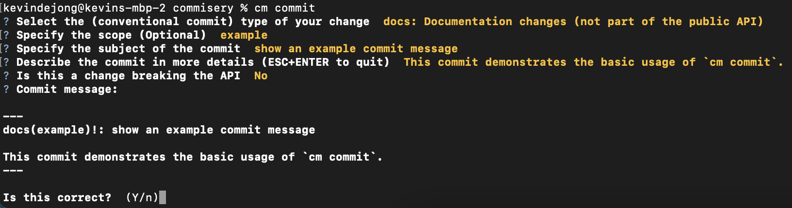
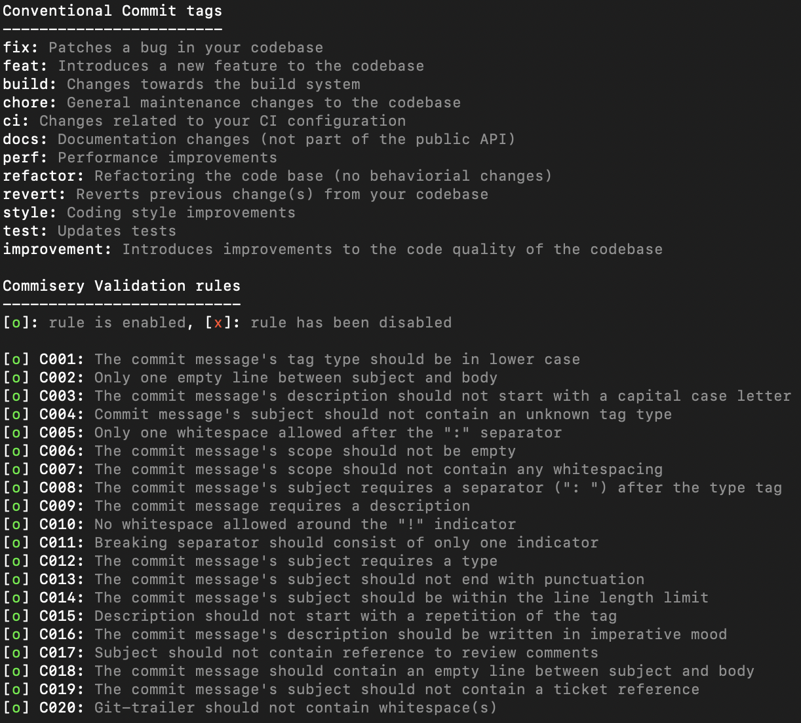

# Commisery

Commisery is a package to help check whether given commit messages adhere to [Conventional Commits].
Specifically, it checks the syntax and some aspects of the semantics.

The purpose of this is severalfold:

1. Achieving a common layout for commit messages in order to help humans more quickly extract useful information
from them.
2. Making these messages partially machine processable in order to classify changes for proper version management.
3. Identifying a subset of common mistakes that render a message useless to your future self or colleagues.

The latter goal usually requires your commit messages to answer these questions:
* **What**: a short summary of _what_ you changed in the subject line.
* **Why**: what the intended outcome of the change is (arguably the _most_ important piece of information that should
go into a message).
* **How**: if multiple approaches for achieving your goal were available, you also want to explain _why_ you chose the
used implementation strategy.
    - Note that you should not explain how your change achieves your goal in your commit message.
      That should be obvious from the code itself.
      If you cannot achieve that clarity with the used programming language, use comments within the code instead.
    - The commit message is primarily the place for documenting the _why_.


## Installation

You can install this package with pip as follows:

```sh
$ python3 -m pip install --user --upgrade commisery
```

## Usage

Basic usage instructions:

```
Usage: cm [OPTIONS] COMMAND [ARGS]...

  Manages conventional commit messages

Options:
  -c, --config TEXT               Path towards a configuration file
  -t, --tags TEXT                 Comma-separated list of accepted
                                  conventional commit tags to allow aside from
                                  the default "feat" and "fix". If omitted,
                                  uses the following list: fix, feat, build,
                                  chore, ci, docs, perf, refactor, revert,
                                  style, test, improvement

  -l, --max-subject-length INTEGER
                                  Maximum characters allowed in the subject of
                                  the commit message

  -d, --disable TEXT              List of commit message rules to disable. Can
                                  be one of: C001, C002, C003, C004, C005,
                                  C006, C007, C008, C009, C010, C011, C012,
                                  C013, C014, C015, C016, C017, C018, C019,
                                  C020

  -v, --verbosity LVL             Either CRITICAL, ERROR, WARNING, INFO or
                                  DEBUG

  --help                          Show this message and exit.

Commands:
  check     Checks whether commit messages adhere to the Convention Commits...
  commit    Creates a conventional commit
  overview  Lists the accepted Conventional Commit tags and Rules (incl.
```

### Create and Commit a new Conventional Commit

You can use `cm commit` to help you create and commit a Conventional Commit using an interactive wizard:



### Verify commit messages

You can verify single commit messages with the included CLI tool:

```sh
$ cm check 8c3349528888a62382afd056eea058843dfb7690
$ cm check master
$ cm check :/'refactor'
$ cm check .git/COMMIT_EDITMSG
$ cm check my-own-message.txt
```

Alternatively, it handles commit-ish revision ranges adhering to the `git rev-list` format:

```sh
$ cm check HEAD~..HEAD
$ cm check HEAD^2~4 ^HEAD^2~6 ^HEAD^3~2
$ cm check master..feat/my-feature
$ cm check HEAD@{yesterday}..HEAD
$ cm check HEAD@{upstream}..HEAD
$ cm check :/'refactor'..HEAD
$ cm check 2fff3d8..8c33495
```

The exit code of will be non-zero *if and only if* it found errors in the given commit message(s).

> **NOTE**: *in order to remain backwards compatible, the command `commisery-verify-msg` can be used as alternative for `cm check`*

### (Pre-) Commit hook

You can use `commisery` as a hook in Git to check messages you wrote by creating a `.git/hooks/commit-msg` file with these contents:
```sh
#!/bin/sh
exec commisery-verify-msg "$@"
```

### Configuration

### Overview of the current configuration

You can run `cm overview` to visualize the current configuration, i.e.:



## Change configuration parameters

You can configure `commisery` using a YAML-based configuration file, i.e.

```yaml
max-subject-length: 120
tags:
  docs: Documentation changes not part of the API
  example: Changes to example code in the repository
disabled:
  - C001
  - C018
```

| Item | Default value |Description | 
| --- | --- | --- |
| `max-subject-length` | `80` | The maximum length of the subject of the commit message |
| `tags` | `fix`, `feat`, `build`, `chore`, `ci`, `docs`, `perf`, `refactor`, `revert`, `style`, `test`, `improvement` | Additional tags (including description). These tags will not result in a version bump.<br><br>**NOTE:** The tags `feat` and `fix` will automatically be provided |
| `disabled` | `None` | List of rules to disable as part of the checker |

By default `commisery` will search for the file `.commisery.yml`.
You can specify a different file with the `--config` command line argument, i.e.

```sh
$ cm --config .conventional-commit-config [COMMAND]
```

Additionally, you can change these parameters using the cli, i.e.:
```sh
$ cm --tags example --max-subject-length 120 --disable C001 [COMMAND]
```


## GitHub support

You can use Commisery based on a GitHub PullRequest by installing the package with the extra `github`:

```sh
$ python3 -m pip install --user --upgrade commisery[github]
```

You can verify the Pull Request title and commit messages with the included CLI tool:

```sh
$ commisery-verify-github-pullrequest --token GITHUB_TOKEN --repository owner/repo --pullrequest-id 1
```

The exit code of that tool will be non-zero if and only if it found errors in the given Pull Request.

## Hopic

Using it as a check in Hopic can be accomplished with a configuration fragment like this:
```yaml
phases:
  style:
    commit-messages:
      - python3 -m virtualenv --clear venv
      - venv/bin/python -m pip install --upgrade 'commisery>=0,<1'
      # Require each commit message to adhere to our requirements
      - foreach: AUTOSQUASHED_COMMIT
        sh: venv/bin/python venv/bin/commisery-verify-msg ${AUTOSQUASHED_COMMIT}
      # Optional: check the produced merge commit message too (this includes the PR title)
      - venv/bin/python venv/bin/commisery-verify-msg HEAD
```

This exact form can also be used through the `commisery` template:

```yaml
phases:
  style:
    commit-messages: !template "commisery"
```

[Conventional Commits]: https://www.conventionalcommits.org/en/v1.0.0/
